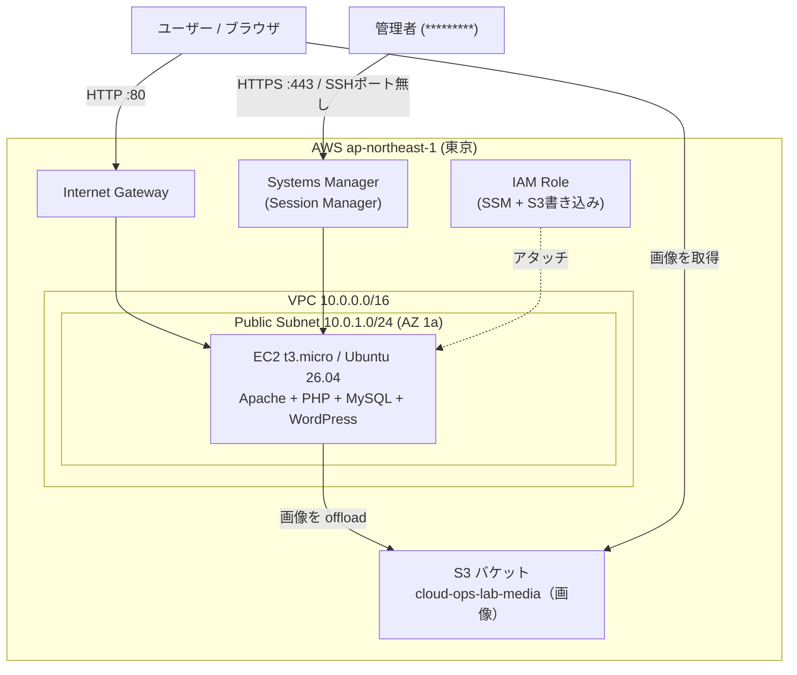

# cloud-ops-lab

AWS 上に、**VPC から手作業で組んだインフラ**の上で WordPress を公開した学習用プロジェクト。
マネージドサービスに頼り切る前に「ネットワーク・サーバー・権限・運用で何が起きているか」を、コンソール操作で一つずつ理解することを目的としています。

> 学習用のラボ環境です（本番運用サイトではありません）。

- **リージョン:** ap-northeast-1（東京）
- **構成:** VPC / EC2(Ubuntu) / Apache + PHP + MySQL / WordPress / S3 / IAM / Systems Manager(SSM)

---

## アーキテクチャ



<details>
<summary>テキスト版（AA）</summary>

```
ユーザー ──HTTP:80──> Internet Gateway ──> EC2 (Apache/PHP/WordPress ─ MySQL同居)
   │                                              │
   └──画像取得────────> S3 (メディア) <──offload──┘

管理者 ──HTTPS:443──> Systems Manager (Session Manager) ──> EC2   ※ SSHポート(22)は開けない
                                       IAM Role (SSM + S3) をEC2にアタッチ
```
</details>

---

## 技術スタック

| レイヤー | 使用技術 |
|---|---|
| ネットワーク | VPC, サブネット, Internet Gateway, ルートテーブル, セキュリティグループ |
| コンピュート | EC2 (t3.micro), Ubuntu Server 26.04 LTS |
| Web / App | Apache 2.4, PHP 8.5, WordPress |
| データベース | MySQL 8.4（EC2に同居） |
| ストレージ | S3（画像メディアのオフロード / WP Offload Media Lite） |
| 権限・認証 | IAM（ロール・最小権限ポリシー） |
| 運用・アクセス | AWS Systems Manager（Session Manager, Run Command） |

---

## 構築内容（サマリ）

1. **ネットワークを手組み** — VPC(10.0.0.0/16) → パブリックサブネット(10.0.1.0/24) → IGW → ルートテーブル(`0.0.0.0/0 → IGW`)。「IGW + ルート + サブネット関連付け」の3点が揃って初めてパブリックになる、を実機で確認。
2. **EC2 を起動** — Ubuntu / t3.micro、セキュリティグループ、Elastic IP。
3. **Web サーバー構築** — `apt` で Apache + PHP を導入し公開確認。
4. **MySQL 構築** — `mysql-server` 導入、DB / 専用ユーザー作成。
5. **WordPress 公開** — 配置 → Web インストーラーで初期設定。
6. **S3 連携** — バケット作成 + IAM ロールで権限付与 + WP Offload Media Lite で画像を S3 へオフロード。

---

## 設計上の工夫・こだわり

- **SSH ポートを開けず、SSM Session Manager で運用**
  22番を一切公開せず、AWS Systems Manager 経由（HTTPS 443）でサーバーに接続。攻撃面を減らし、拠点（自宅/社外）が変わっても接続できる構成に。
- **アクセスキーを置かず、IAM ロールで権限委譲**
  EC2 に IAM ロールをアタッチし、S3 への書き込みをロールで付与。サーバー上にアクセスキーを保存しない。
- **最小権限を意識した IAM ポリシー**
  ロールに付けるポリシーは、対象バケットとオブジェクトに絞ったカスタムポリシーで記述（バケット ARN とオブジェクト ARN の粒度の違いを意識）。
- **バケットは Block Public Access を制御しつつ、公開はバケットポリシーで明示**

---

## トラブルシューティングで学んだこと

実機ゆえに「教科書通りに進まない」場面が多く、そこが一番の収穫でした。

- **SSH がタイムアウト → 原因は接続元 IP の揺れ（CGNAT）**
  セキュリティグループは正しいのに繋がらず、切り分けの結果、`curl` で見える IP と実際の SSH 送信元 IP が接続ごとに変わっていた（サーバーの `Last login ... from` で判明）。恒久対策として SSM 運用へ移行。
- **WordPress 配置中にインスタンスがフリーズ → メモリ不足（OOM）**
  1GB の t3.micro でスワップ無しのため WordPress + MySQL でメモリ枯渇。**スワップ追加 + MySQL / Apache の省メモリ設定**で安定化。スワップは `/etc/fstab` に登録しないと再起動で消える点も学んだ。
- **S3 オフロードが失敗 → 権限とバケットの ACL 設定の不整合**
  最小権限ロールで順に不足権限（`PutObjectAcl`、バケット設定の読み取り権限）を洗い出し、プラグインの公開方式（オブジェクト ACL）に合わせてバケットの Object Ownership を調整して解決。「ツールが実際に必要とする権限を突き止める」プロセスを体験。

---

## セキュリティ

- インバウンドは **HTTP(80) のみ公開**。SSH(22) は開けず、サーバー操作は SSM 経由。
- サーバーへの権限付与は **IAM ロール**（アクセスキーをサーバーに置かない）。

---

## コスト（学習用アカウントでの注意）

- EC2 / Elastic IP は稼働中コストが発生。使わない期間は EC2 を停止（ただし停止中は Elastic IP が課金対象になる点に注意）。
- 学習終了時は EC2 削除 → EIP 解放 → 不要な EBS / S3 / SG を削除。

---

## 今後の展望（ロードマップ）

- **Phase 2:** RDS へ DB を分離（三層アーキテクチャ）
- **Phase 3:** GitHub + Terraform でここまでの構成をコード化（IaC）
- **Phase 4:** Lambda（Python）でサイト死活監視 + 通知
- **Phase 5:** Docker → Kubernetes（コンテナ化・オーケストレーション）

---

## リポジトリ運用メモ

- `wp-config.php`、`*.pem`（秘密鍵）、各種パスワードは **コミットしない**（`.gitignore` で除外）。
